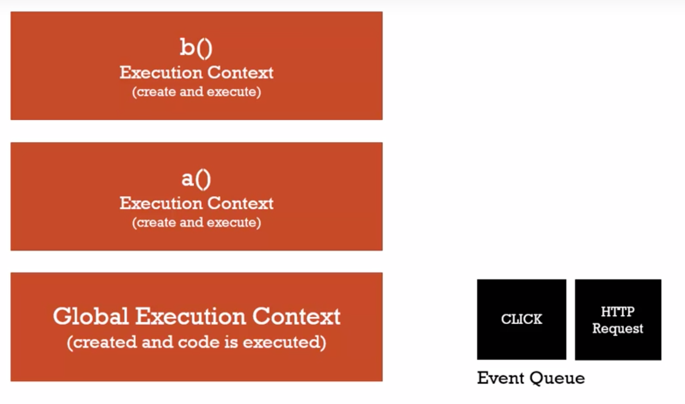

# Big Words Java Script


### Primitive types: 
``` javascript
 boolean,  number, undefined, symbol, string, null. 
```


### Single Thread 




### Associative 

```javascript 
var a =  2, b = 3, c =4;
a = b = c;

console.log(a);

result iguals 4. 
```
[Link](https://developer.mozilla.org/en-US/docs/Web/JavaScript/Reference/Operators/Operator_Precedence) to search precedence

### Equanlity and comparesions

https://developer.mozilla.org/en-US/docs/Web/JavaScript/Equality_comparisons_and_sameness


### JSON and Object Literals 

Object literals exemple
```javascript
var objectLiteral = {
   firstName : "Caio",
   age : 18
}
```
JSON -> JavaSript Object Notation

```json
{
 "firstName" : "Caio",
 "age" : 18
}
```

tranformome object literal to JSON 
```javascript 
console.log(JSON.stringfy(objectLiteral));
````

### Function

- Function are objects
- Function and object are passed by reference. primitive types are passed by value
- var belongs the execution context
```javascript

var teste = "global"

function print(){
    this.teste = "in method printf";
    console.log(teste);
}


print();

console.log(teste);

//out put
//in method printf
//global

```

### Immediately Invoked Functions Expressions 

```javascript
(function(name){
   console.log(name);
})();
```


### bind , call , apply

```javascript
var person = {
    firstname: 'John',
    lastname: 'Doe',
    getFullName: function() {
        
        var fullname = this.firstname + ' ' + this.lastname;
        return fullname;
        
    }
}

var logName = function(lang1, lang2) {

    console.log('Logged: ' + this.getFullName());
    console.log('Arguments: ' + lang1 + ' ' + lang2);
    console.log('-----------');
    
}

var logPersonName = logName.bind(person);
logPersonName('en','en');

logName.call(person, 'en', 'es');
logName.apply(person, ['en', 'es']);

```


### function borrowing

```javascript

var person = {
    firstname: 'John',
    lastname: 'Doe',
    getFullName: function() {
        
        var fullname = this.firstname + ' ' + this.lastname;
        return fullname;
        
    }
}

var person2 = {
    firstname: 'Jane',
    lastname: 'Doe'
}

console.log(person.getFullName.apply(person2));
```


### function constructor 


```javascript
var car = new Car()
```

- The name javascript was choised just because to atract java developers. 
- function constructors is just a normal function that is used to construct objects 
the variable 'this' points a new empty object and that object is returned from the function
automatically


### Prototype

- That variable can be only use in "function constructor" (key word new )
- You can add value to a prototy any time, and all objects you recive that object. 


```javascript
function Person(firstname, lastname) {
 
    console.log(this);
    this.firstname = firstname;
    this.lastname = lastname;
    console.log('This function is invoked.');
    
}

Person.prototype.getFullName = function() {
    return this.firstname + ' ' + this.lastname;   
}

var john = new Person('John', 'Doe');
console.log(john);

var jane = new Person('Jane', 'Doe');
console.log(jane);

Person.prototype.getFormalFullName = function() {
    return this.lastname + ', ' + this.firstname;   
}

console.log(john.getFormalFullName());
`
```
## Opertator == and ===

```javacript
var a = 1
var b = new Number(1);
a == b // true
a === b // false, it compares the type
```

